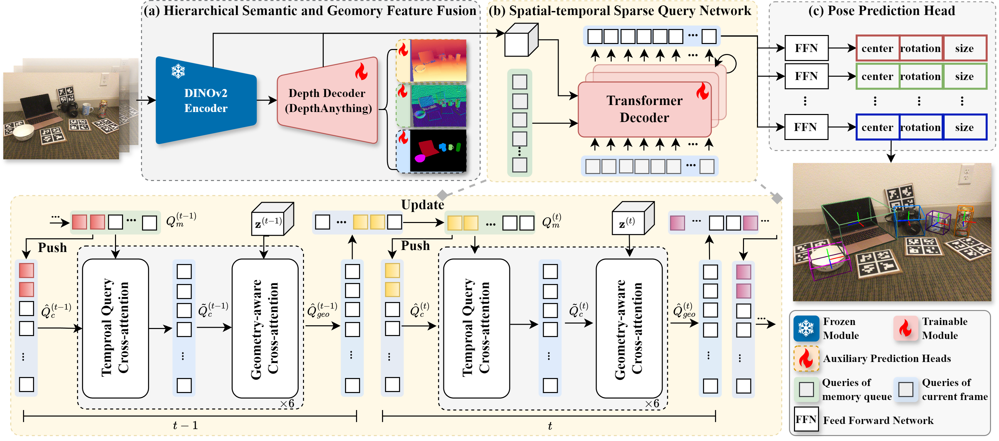
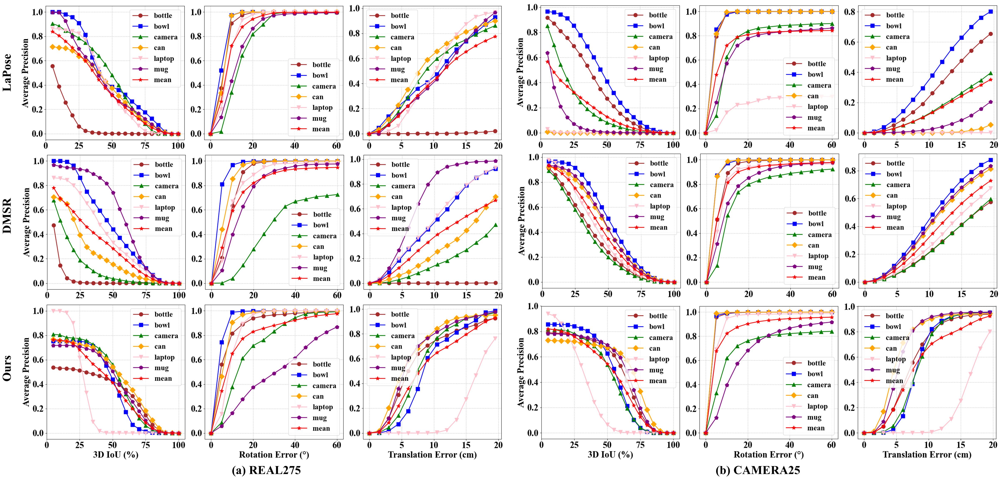
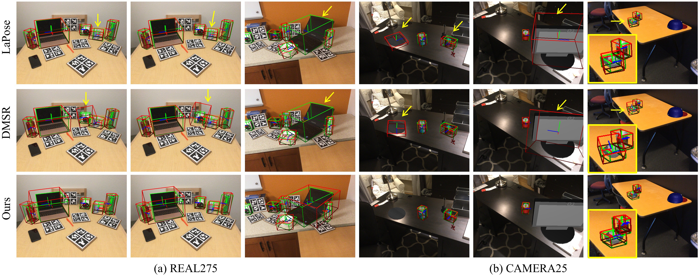

# SeqPose
**SeqPose: An End-to-End Framework to Unify Single-frame and Video-based RGB Category-Level Pose Estimation.**

## 🔥 Overview
Category-level object pose estimation is a longstanding and fundamental task crucial for augmented reality and robotic manipulation applications. 
Existing RGB-based approaches struggle with multi-stage settings and heavily rely on off-the-shelf techniques, such as object detectors, depth estimators, non-differentiable NOCS shape alignment, etc. 
Extra dependencies lead to the accumulation of errors and complicate the whole pipeline, limiting the deployment of these approaches in practical applications. 
This paper streamlined an end-to-end framework unifying the single-frame and video-based category-level pose estimation. 
Specifically, instead of explicitly introducing extra dependencies, the DINOv2 encoder and depth decoder, as robust semantic and geometric prior extractors, are leveraged to produce intra-frame hierarchical semantic and geometric features. A spatial-temporal sparse query network is developed to model the implicit correspondence and inter-frame correlations between a set of implicit 3D query anchors and intra-frame features. Finally, a pose prediction head is employed using the bipartite matching algorithm. 
Experimental results demonstrate that our model achieves state-of-the-art performance compared with RGB-based categorical pose estimation methods on the REAL275 and CAMERA25 datasets.


## <a id="Method">⭐️ Pipeline</a>

<div align="center">

</div>

**Overview of our proposed framework.** Our framework integrates the DINOv2 encoder and a depth decoder to extract hierarchical semantic and geometry-aware features **(a)**. A spatial-temporal sparse query network **(b)** aggregates intra-frame features using inter-frame correlations of implicit 3D query anchors. The pose prediction head **(c)** directly regresses the object pose and size from the learned queries.


## 🛠️ Setup

```bash
# clone repo.
git clone https://github.com/AndrewChiyz/SeqPose.git
cd SeqPose

# build conda env.
conda create -n seqpose python=3.8
conda activate seqpose
pip install -r requirements.txt
```

### <a id="OurResults"> ⭐️ Results in our paper</a>

*1. AP curves in terms of different types of errors on (a) REAL275 and (b) CAMERA25 datasets:*

<div align="center">

</div>


*2. Fualitative results. The predicted and GT 3D bounding boxes are marked in red and green, respectively:*

<div align="center">

</div>

*Note: For more detail results, please refer to our [main paper and appendix](https://andrewchiyz.github.io/vision.3dv.seqpose/)*


## 📑 Citation
If you find this project useful, welcome to cite us.
```bib
@inproceedings{ijcai25seqpose,
      author       = {Yuzhu Ji and
                      Mingshan Sun and
                      Jiayang Shi and
                      Xiaoke Jiang and
                      Yiqun Zhang and
                      Haijun Zhang},
      title        = {SeqPose: An End-to-End Framework to Unify Single-frame and Video-based RGB Category-Level Pose Estimation},
      booktitle    = {{IJCAI} 2025},
      pages        = {1--9},
      year         = {2025},
}
```